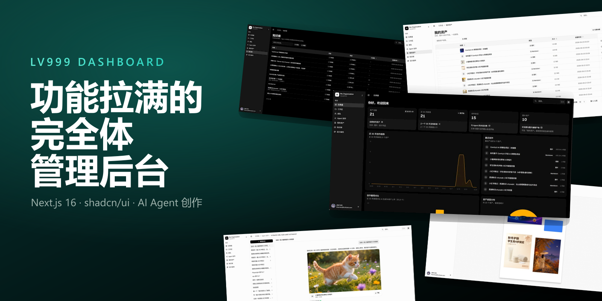

# LV999 Dashboard

> **LV999** —— lv = level。功能拉满、什么都有、完全体的管理后台。

一个全功能的管理后台仪表盘：认证、多租户、权限、数据表格、表单、图表、主题……全部端到端可用。不是静态演示，而是一个能直接长出真实业务的地基——目前已在其上长出一个生产级的 **AI Agent 创作模块**（对话创作、文生图 / 图生图、资产沉淀）。



## 项目简介

LV999 Dashboard 定位为个人项目的统一后台底座——功能完整、生产级、快速起步：

- **功能全部可运行**：数据表格真实地搜索 / 筛选 / 排序 / 分页；表单真实地校验、提交并失效缓存；认证与组织端到端打通。
- **工程模式生产级**：数据层遵循 TanStack Query 官方 SSR 模式，按 feature 组织模块，每个模块的 `api/service.ts` 是接入真实后端时唯一需要替换的文件。
- **AI Agent 创作模块已落地**：自然语言对话 → 生成 Markdown / HTML / 图片作品并沉淀为可管理的资产；已接入真实后端（PostgreSQL + 对象存储 + Redis + 大模型），非 Mock，详见 [docs/agent.md](./docs/agent.md)。
- **开箱即用**：后台骨架内置 Mock 数据，配好 Clerk 密钥即可跑通；Agent 创作模块另需数据库 / 模型 / 存储 / Redis 配置（见 [docs/agent.md](./docs/agent.md)）。

## 功能特性

- **AI Agent 创作**：自然语言对话驱动的内容创作工作台（`ToolLoopAgent`）；可生成 Markdown / HTML 文本作品与文生图 / 图生图（I2I）图片；基于 `resumable-stream` 的可恢复 SSE 流（刷新 / 切回自动重连），支持跨实例停止生成
- **设计画布**：基于 Konva 的 Canva/Figma 式画布编辑器；摆放文字 / 图形 / 图片（可引用 Agent 生成的图片资产），选中/移动/缩放/旋转、撤销重做、导出 PNG，产物沉淀为可重新编辑的 `design` 资产
- **我的资产**：Agent 与设计画布的产出统一沉淀为可管理资产；复用数据表格模式，支持按类型筛选 / 搜索 / 预览 / 下载 / 删除，图片经 OSS 签名 URL 访问
- **总览仪表盘**：统计卡片 + Recharts 图表；基于并行路由（Parallel Routes），每个区块拥有独立的加载与错误状态
- **数据表格**：服务端预取 + 客户端查询缓存 + 水合（HydrationBoundary），搜索 / 筛选 / 排序 / 分页与 URL 同步（nuqs），`shallow: true` 让交互零 RSC 往返
- **表单体系**：TanStack Form + Zod；可复用字段组件、多步表单、对话框 / 抽屉表单，提交后自动失效相关查询缓存
- **认证与账户**：Clerk 提供无密码登录、社交登录、企业 SSO 与账户管理
- **多租户工作区**：Clerk Organizations —— 创建、切换、管理组织与团队角色
- **导航 RBAC**：按组织 / 权限 / 角色过滤菜单项
- **命令面板**：⌘K / Ctrl+K 快速搜索与跳转（kbar）
- **主题系统**：基于 `data-theme` 与 CSS 变量的可扩展多主题架构（当前内置 Vercel 主题）
- **Infobar 提示侧栏**：为任意页面提供上下文说明与文档入口

## 技术栈

| 类别 | 选型 |
| --- | --- |
| 框架 | Next.js 16（App Router） |
| 语言 | TypeScript 5.7（strict） |
| UI 组件 | shadcn/ui（Base UI primitives） |
| 样式 | Tailwind CSS v4 |
| 认证 / 组织 | Clerk |
| AI / Agent | AI SDK v7（`ai` + `@ai-sdk/alibaba` / `@ai-sdk/openai-compatible`），百炼（阿里云 Model Studio） |
| 设计画布 | Konva + react-konva（2D canvas） |
| 数据库 / ORM | PostgreSQL（阿里云 RDS） + Drizzle ORM |
| 对象存储 | 阿里云 OSS（图片等二进制资产） |
| 缓存 / 流恢复 | Redis（resumable-stream 与停止信号 / 限流） |
| 数据请求 | TanStack Query v5（SSR + Suspense） |
| 数据表格 | TanStack Table v8 |
| 表单 | TanStack Form + Zod v4 |
| URL 状态 | nuqs |
| 图表 | Recharts |
| 命令面板 | kbar |
| 代码检查 / 格式化 | Oxlint / Oxfmt + Husky（pre-commit） |
| 包管理器 | Bun（推荐）或 npm |

## 页面一览

| 路由 | 说明 |
| --- | --- |
| `/dashboard/overview` | 总览：统计卡片 + 图表（并行路由独立加载） |
| `/dashboard/agent` | Agent 创作：新建会话与对话创作入口 |
| `/dashboard/agent/[conversationId]` | Agent 会话：可恢复流式对话、工具调用与对话内资产卡片 |
| `/dashboard/assets` | 我的资产：资产表格（筛选 / 搜索 / 预览 / 下载 / 删除） |
| `/dashboard/design` | 设计画布：新建空白画布 |
| `/dashboard/design/[id]` | 设计画布：打开已存设计继续编辑 |
| `/dashboard/workspaces` | 工作区管理：Clerk `<OrganizationList />` |
| `/dashboard/workspaces/team` | 团队管理：Clerk `<OrganizationProfile />`（需激活组织） |
| `/dashboard/profile` | 个人资料与安全设置（Clerk 账户管理） |
| `/auth/sign-in`、`/auth/sign-up` | 登录 / 注册 |

## 快速开始

**前置要求**：Node.js 22（见 `.nvmrc`）或 Bun，推荐使用 Bun。

```bash
# 1. 安装依赖
bun install

# 2. 配置环境变量
cp env.example.txt .env.local
# 然后填入 Clerk 密钥（见下方说明）

# 3. 启动开发服务器
bun run dev
```

访问 http://localhost:3000。

### 关键环境变量

| 变量 | 说明 |
| --- | --- |
| `NEXT_PUBLIC_CLERK_PUBLISHABLE_KEY` / `CLERK_SECRET_KEY` | Clerk 密钥，必填 |
| `NEXT_PUBLIC_APP_URL` | 应用公开地址（用于 metadataBase，本地为 `http://localhost:3000`） |
| `NEXT_PUBLIC_CLERK_SIGN_IN_URL` 等 | 登录 / 注册与重定向地址（默认值已够用） |
| `BUILD_STANDALONE` | Docker / 自托管时设为 `"true"`，启用 standalone 输出 |
| `DATABASE_URL` | PostgreSQL 连接串（Agent 模块） |
| `DASHSCOPE_API_KEY` | 阿里云百炼 API Key（对话与图片模型） |
| `OSS_REGION` / `OSS_BUCKET` / `OSS_ACCESS_KEY_ID` / `OSS_ACCESS_KEY_SECRET` | 阿里云 OSS（图片等二进制资产） |
| `REDIS_URL` | Redis 连接串（流恢复 / 停止信号 / 限流，需 pub/sub） |

后台骨架仅需 Clerk 密钥即可运行；`DATABASE_URL` 及之后的变量仅 Agent 创作模块需要。完整变量说明见 `env.example.txt`；Clerk 的完整配置（Organizations 等）见 [docs/clerk_setup.md](./docs/clerk_setup.md)；Agent 模块的完整配置与架构见 [docs/agent.md](./docs/agent.md)。

### 常用命令

| 命令 | 说明 |
| --- | --- |
| `bun run dev` | 启动开发服务器 |
| `bun run build` / `bun run start` | 生产构建 / 启动 |
| `bun run typecheck` | TypeScript 类型检查 |
| `bun run lint` / `bun run lint:strict` | Oxlint 检查 |
| `bun run lint:fix` | 自动修复并格式化 |
| `bun run format` / `bun run format:check` | Oxfmt 格式化 / 校验 |

## 项目结构

```plaintext
src/
├── app/                    # Next.js App Router
│   ├── auth/               # 登录 / 注册页
│   ├── dashboard/          # 后台路由
│   │   ├── overview/       # 总览（并行路由：@area_stats、@bar_stats、@pie_stats、@sales）
│   │   ├── agent/          # Agent 创作（会话列表 + [conversationId] 会话页）
│   │   ├── assets/         # 我的资产（资产表格）
│   │   ├── design/         # 设计画布（新建 + [id] 编辑页）
│   │   ├── workspaces/     # 工作区与团队
│   │   └── profile/        # 个人资料
│   └── api/agent/          # Route Handlers：chat（SSE 流）/ conversations / assets（含 design 写入与 /raw 代理）
├── components/
│   ├── ui/                 # shadcn/ui 组件库
│   ├── layout/             # 布局（侧边栏、顶栏、Infobar 等）
│   ├── forms/              # 表单字段组件（Field anatomy）
│   ├── themes/             # 主题系统
│   └── kbar/               # ⌘K 命令面板
├── features/               # 按功能划分的模块（agent、design、auth、overview、profile）
│   └── <name>/
│       ├── api/            # types.ts → service.ts → queries.ts
│       ├── components/
│       ├── schemas/        # Zod 校验
│       └── constants/      # 筛选 / 选项配置
├── config/                 # 导航（含 RBAC）、Infobar、表格配置
├── constants/              # Mock 数据
├── hooks/                  # 自定义 hooks
├── lib/                    # 工具（query-client、searchparams、api-client、oss、redis 等）
│   └── db/                 # Drizzle schema 与连接（getDb）
├── styles/                 # 全局样式与主题 CSS
└── types/                  # 类型定义
```

## 核心设计

### 数据获取：TanStack Query SSR 模式

服务端 `prefetchQuery`（`void` 触发，不阻塞渲染）→ `HydrationBoundary` + `dehydrate` 注水 → 客户端 `useSuspenseQuery` 消费缓存；配合 `<Suspense>` 在流式渲染期间展示骨架屏。

### Service 层：接后端只改一个文件

每个 feature 的 `api/` 目录是三件套：

```plaintext
types.ts    # 类型契约（响应结构、筛选参数、提交载荷）
service.ts  # 数据访问 —— 接入真实后端时唯一需要替换的文件
queries.ts  # React Query options + 查询键工厂（稳定不变）
```

支持多种后端接入方式：Server Actions + ORM、Route Handlers + ORM、BFF 代理（Laravel / Go 等）、直连外部 API。`src/app/api/` 下的 Route Handlers 与 `src/lib/api-client.ts` 已就绪。

### AI Agent 创作模块

自然语言 → AI SDK v7 `ToolLoopAgent` → Markdown / HTML / 图片作品，统一沉淀为可管理资产。已接入真实后端：PostgreSQL + Drizzle（`conversations` / `messages` / `assets` 三表）、阿里云 OSS（图片二进制）、Redis（可恢复流与停止信号 / 限流）、百炼大模型。完整架构、数据模型、流式与停止机制、模型注册表与 API 契约见 [docs/agent.md](./docs/agent.md)。

### 设计画布编辑器

基于 Konva + react-konva 的 Canva/Figma 式画布（纯客户端孤岛，`next/dynamic({ ssr: false })` 挂载）。文档为自持有的可序列化 JSON，作为 `kind='design'` 资产落库（`content` 存文档、`storageKey` 存导出 PNG 预览），**不新增数据库表**。图片对象只存 `assetId` 引用，经同源 `/raw` 代理加载以规避画布跨域污染。完整架构、文档模型、导出与保存链路见 [docs/design-editor.md](./docs/design-editor.md)。

### URL 状态：nuqs

服务端用 `searchParamsCache` 读取，客户端用 `useQueryState(shallow: true)` 写入；表格的分页 / 筛选不触发 RSC 往返，刷新或分享链接也能还原视图。

### 表单：TanStack Form + Zod

`createFormHook` + 可复用 Field 组件，Schema 定义在 `features/*/schemas/`；提交走 `useMutation`，成功后通过查询键工厂失效缓存。详见 [docs/forms.md](./docs/forms.md)。

### 权限：RBAC 导航

`src/config/nav-config.ts` 中用 `access` 声明 `requireOrg` / `permission` / `role` / `plan` / `feature`，`useFilteredNavGroups()` 在客户端过滤菜单。这仅是 UX 层；真正的安全校验由 Clerk 在服务端完成，详见 [docs/nav-rbac.md](./docs/nav-rbac.md)。

### 主题系统

主题由 `[data-theme]` 选择器与 CSS 变量驱动，通过 `active_theme` cookie 持久化；新增主题的完整步骤见 [docs/themes.md](./docs/themes.md)。

## 部署

- **Vercel**：连接仓库、配置环境变量即可一键部署。
- **Docker**：内置 `Dockerfile`（Node.js）与 `Dockerfile.bun`（Bun），基于 Next.js standalone 输出，镜像更小。

完整说明见 [docs/deployment.md](./docs/deployment.md)。

## Roadmap

- [x] 完整后台骨架：认证 / 多租户 / RBAC / 数据表格 / 表单 / 主题
- [x] AI Agent 创作模块：对话创作、文生图 / 图生图、资产沉淀，已接入真实后端（PostgreSQL + OSS + Redis + 百炼）
- [x] 设计画布编辑器：Konva 画布、文字 / 图形 / 图片摆放、导出 PNG、产物沉淀为 `design` 资产
- [ ] 视频产物（Phase 3：schema 与 OSS 已预留）
- [ ] 替换预览截图与 OG 图（当前为 AI 生成的宣传图，后期将替换为真实界面截图）
- [ ] 按需扩展业务模块

## 许可证与致谢

本项目基于 [Kiranism/next-shadcn-dashboard-starter](https://github.com/Kiranism/next-shadcn-dashboard-starter) 二次开发，感谢原作者 [Kiranism](https://github.com/Kiranism) 的开源工作。

项目采用 [MIT License](./LICENSE)，原始版权声明已保留在 LICENSE 文件中。
